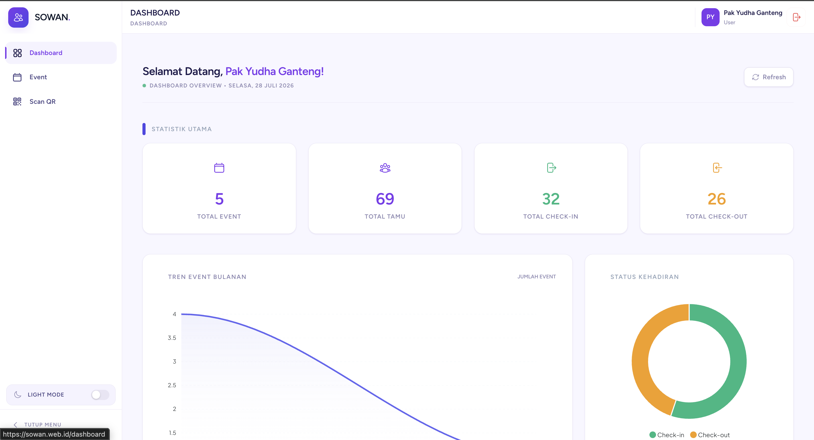
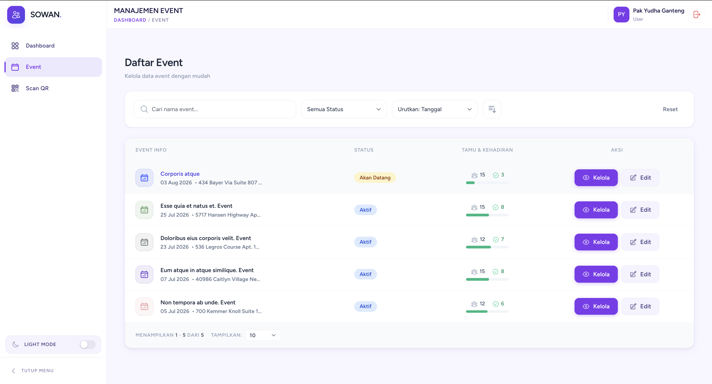
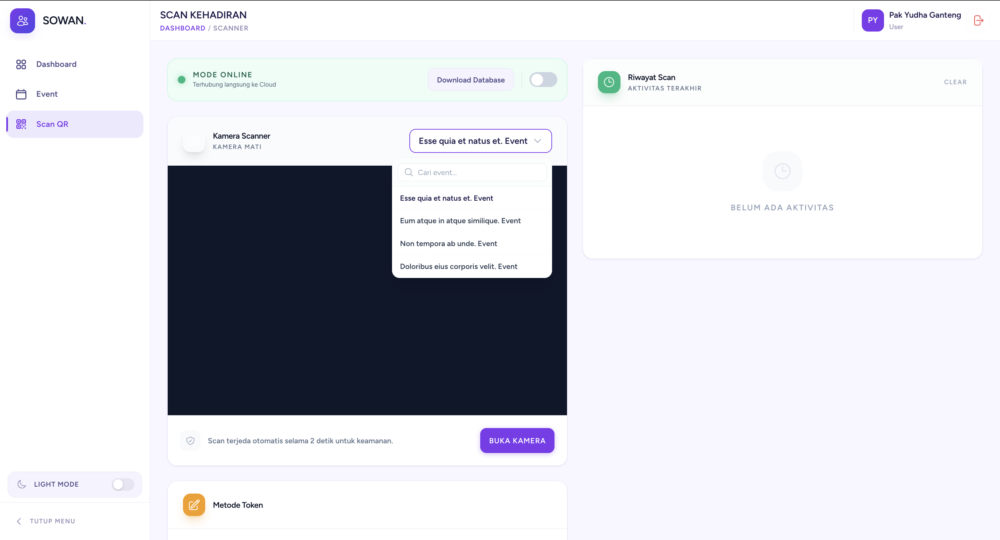
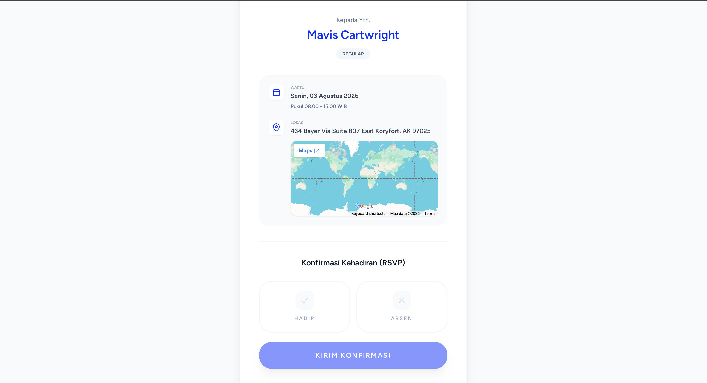

<div align="center">
  
  
  <h1>🎉 Sowan (Buku Tamu Digital)</h1>
  <p><strong>Aplikasi Buku Tamu & Manajemen Event yang Simpel dan Modern</strong></p>

  <p>
    
    
    
    
    
  </p>
  
  <p>
    <em>Nggak perlu lagi pakai buku tamu kertas atau antre panjang di meja resepsionis. Sowan bikin urusan check-in tamu event kamu jadi lebih rapi, cepat, dan terdigitalisasi.</em>
  </p>
</div>

---

## 📌 Apa itu Sowan?

**Sowan** adalah aplikasi buku tamu digital dan manajemen event yang dibikin khusus untuk mempermudah acara seperti pernikahan, gathering, seminar, atau pesta lainnya. 

Aplikasi ini dibangun pakai **Laravel 11/12** untuk backend-nya dan **Vue.js 3** via **Inertia.js** di frontend. Hasilnya? Sebuah *Single Page Application* (SPA) yang kencang dan mulus, tanpa repot bikin API yang terpisah.

## ✨ Fitur Utama

### 🎫 Manajemen Event Terpusat
- **Banyak Event Sekaligus:** Kamu bisa bikin dan kelola banyak event dalam satu sistem.
- **Kustomisasi:** Sesuaikan tema, warna, dan ucapan selamat datang di halaman depan sesuai selera.
- **Peta Lokasi:** Tersedia integrasi link dan embed Google Maps biar tamu nggak nyasar.
- **Batas Waktu Check-in:** Set kapan event mulai dan selesai, sistem bakal otomatis nutup akses check-in kalau udah lewat batas waktu.

### 👥 Urusan Tamu
- **Import Masal:** Punya ratusan tamu? Tinggal import pakai file Excel/CSV.
- **RSVP & Kuota:** Pantau siapa yang memastikan datang, yang absen, dan atur batasan bawaan tamu tambahan (pax).
- **Auto QR Code:** Tiap tamu otomatis dibuatin QR code unik untuk check-in.
- **Undangan PDF:** Tamu bisa download undangan versi PDF yang udah nempel sama QR code-nya biar gampang dicetak.

### 💬 Blast WhatsApp (via Fonnte)
- **Kirim Undangan Sekali Klik:** Kirim undangan WA secara massal langsung dari dashboard.
- **Anti Spam:** Dilengkapi jeda pengiriman (delay) otomatis supaya blast WA aman dan nggak gampang diblokir.

### 📱 Scanner Pintar
- **Web-based Scanner:** Tinggal buka browser hp, langsung bisa scan QR pakai kamera bawaan (`html5-qrcode`). Nggak butuh install aplikasi tambahan dari PlayStore/AppStore.
- **Offline Mode:** Pas event tiba-tiba internet mati atau sinyal jelek? Tenang, data tamu bisa di-download ke local storage. Scanner bakal tetap jalan offline, dan otomatis sinkron lagi ke server waktu internet nyala.
- **Check-in Manual:** Kalau tamu lupa bawa QR, panitia bisa cari nama atau masukin token secara manual di form check-in.
- **Notif Suara:** Ada bunyi "beep" tiap berhasil scan, ngebantu banget biar panitia tahu check-in sukses tanpa harus bolak-balik ngecek layar hp.

### 🛡️ Keamanan
- **Login OTP:** Ada fitur keamanan ekstra buat login Admin/Superadmin pakai OTP yang dikirim ke email.

### 📊 Dashboard & Statistik
- **Real-time Data:** Pantau langsung jumlah tamu undangan, yang udah masuk, yang keluar, dan status RSVP secara langsung.
- **Grafik Interaktif:** Visualisasi data yang memanjakan mata pakai ApexCharts.
- **Export Data:** Gampang kalau mau rekap kehadiran tamu pasca-event, tinggal export ke file Excel atau PDF.

## 🔐 Hak Akses (Role)

Sowan pakai sistem hak akses (RBAC) dari `spatie/laravel-permission`:

1. **Superadmin**: Bos besar. Bisa bikin event, kelola user, dan ngatur role.
2. **Event Admin**: Cuma bisa kelola tamu, liat statistik, dan pakai scanner khusus buat event yang ditugasin ke dia.
3. **Scanner/Receptionist**: Cuma dikasih akses buat buka halaman scanner QR untuk check-in tamu. Nggak bisa akses data lain.

---

## 🛠 Tech Stack

**Backend:**
- Framework: [Laravel](https://laravel.com/)
- Database: MySQL / PostgreSQL / SQLite
- Auth: Laravel Breeze + Custom OTP
- Queues: Database / Redis (buat handle antrean blast WA biar server nggak kepayahan)
- Export Excel/PDF: `maatwebsite/excel` & `barryvdh/laravel-dompdf`

**Frontend:**
- Framework: [Vue.js 3](https://vuejs.org/) (Composition API)
- Bridge: [Inertia.js](https://inertiajs.com/)
- Styling: [Tailwind CSS](https://tailwindcss.com/)
- Scanner: [html5-qrcode](https://github.com/mebjas/html5-qrcode)
- Alerts: SweetAlert2

---

## 🚀 Cara Install di Local (Development)

Kalau kamu mau jalanin project ini di laptop/PC buat diutak-atik, ikuti langkah ini ya:

### Syarat
- PHP >= 8.2
- Composer
- Node.js (v18+) & npm
- Database (MySQL/MariaDB/PostgreSQL/SQLite)
- Akun & API Token [Fonnte](https://fonnte.com/) (Opsional, khusus kalau mau nyoba fitur WA)

### Langkah-langkah

1. **Clone Repo**
   ```bash
   git clone https://github.com/manalpinn/sowan.git
   cd sowan
   ```

2. **Install Package PHP**
   ```bash
   composer install
   ```

3. **Install Package JavaScript**
   ```bash
   npm install
   ```

4. **Siapin .env**
   Copy file env example dan generate app key:
   ```bash
   cp .env.example .env
   php artisan key:generate
   ```
   *Jangan lupa buka file `.env` dan sesuaikan config database-nya ya (`DB_CONNECTION`, `DB_DATABASE`, dll).*

5. **Migrate & Seed Database**
   Biar struktur tabelnya dibuat dan langsung ada akun Superadmin bawaan:
   ```bash
   php artisan migrate --seed
   ```

6. **Setting Queue (Penting!)**
   Karena kirim WA & Email jalannya di background biar web nggak *freeze*, pastikan ubah line ini di `.env`:
   ```env
   QUEUE_CONNECTION=database
   ```

7. **Setting Fonnte (Opsional)**
   Kalau mau coba fitur WA, masukin token Fonnte kamu di `.env`:
   ```env
   FONNTE_TOKEN=token_kamu_disini
   ```

8. **Build Frontend**
   Biar styling Tailwind dan Vue-nya berhasil dikompilasi:
   ```bash
   npm run build
   
   # Atau kalau lagi mode aktif ngoding (development):
   npm run dev
   ```

9. **Jalankan Aplikasi**
   Buka terminal baru, jalankan server pengembangan Laravel:
   ```bash
   php artisan serve
   ```
   
10. **Jalankan Queue Worker**
    Buka *satu tab terminal lagi* khusus buat ngejalanin proses background (seperti antrean email/WA):
    ```bash
    php artisan queue:work
    ```

---

## 📸 Screenshots

- **Dashboard:**
  
  

- **Manajemen Event:**
  
  

- **Tampilan Scanner:**
  
  

- **Undangan Publik:**
  
  

---

## 🤝 Kontribusi

Mau ikut ngembangin Sowan? Boleh banget! Bantuan dalam bentuk *pull request* sekecil apapun akan sangat diapresiasi.

1. Fork repo ini
2. Bikin branch baru buat fitur kamu (`git checkout -b feature/FiturKeren`)
3. Commit perubahan lu (`git commit -m 'Nambahin beberapa fitur keren nih'`)
4. Push ke branch (`git push origin feature/FiturKeren`)
5. Bikin Pull Request!

## 📄 Lisensi

Project ini dirilis pakai Lisensi MIT. Intinya bebas dipakai dan dimodifikasi. Cek file `LICENSE` buat detail lengkapnya.
